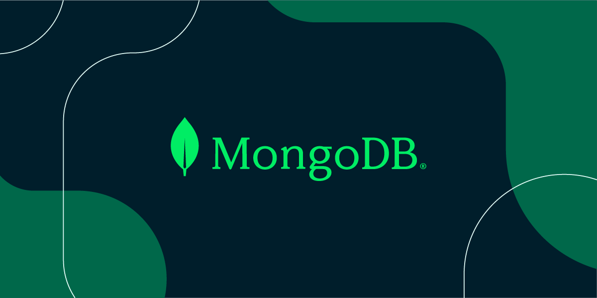
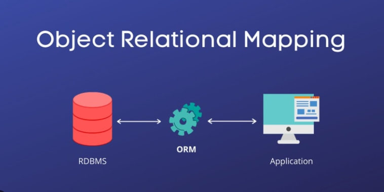

# Education Data Analyst 

  

Welcome! I'm a data analyst passionate about turning numbers into insights.

## About Me
I specialize in data cleaning, visualization, and reporting using Excel, SQL, and Tableau. I love finding patterns that help businesses make better decisions.

## Projects

### 📊 Capstone Project: Malaria effect on primary school children in Ibadan.

**Description:** Analyzed 2 years of sales data to identify top-performing products and seasonal trends.

**Tools Used:** Excel, Tableau, SQL

**Key Findings:**
- Identified 15% of failure amongst pupils in ibadan.
- Discovered high loss of interest in going to sschool
- Created interactive dashboard for monthly tracking

### Research Article and Videographical documentation 
---
[Detiailed article to the project →](link-to-project-folder)

Click to watch our research videographic documentation. 
    

---
##  Team Research Project Customer Segmentation Study

**Description:** Segmented 10,000 customers into 5 groups based on purchasing behavior.

**Tools Used:** SQL, Excel, Power BI

**Key Findings:**
- VIP customers (8% of base) generated 35% of revenue
- Recommended targeted marketing campaigns
- Reduced churn risk by 12% through early intervention

[View Project Files →](link-to-project-folder)

---

## Skills
- **Data Analysis:** Excel (Advanced), Google Sheets
- **Databases:** SQL, MySQL
- **Visualization:** Tableau, Power BI
- **Other:** Data cleaning, Statistical analysis, Reporting

## Contact
- 📧 Email: oluwatunlaayodeji@gmail.com
- 💼 LinkedIn: [linkedin.com/in/ayodejidennis](link)
- 📊 Tableau Public: [public.tableau.com/profile/sarahchen](link)
- Power BI: 

